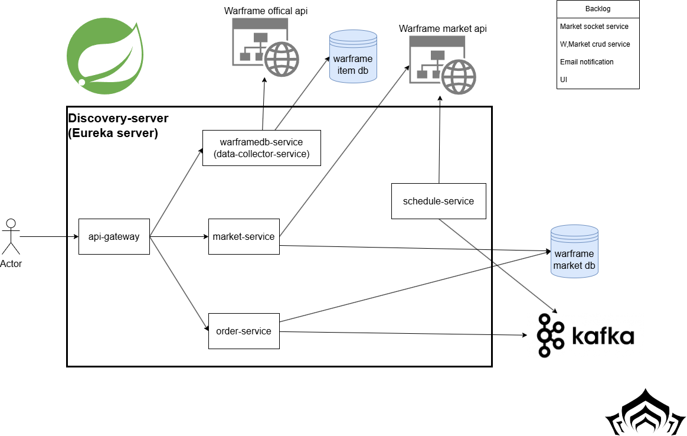

# Project: Java Spring Microservice using Eureka, Kafka

## About the Project
This project is designed to support Warframe players with a useful search engine and continuous tracking of item selling and buying on the third-party website, warframe.market

### Functions
- **Search Engine:** Allows players to search for various items and information.
- **Mastery Process Table:** Players can write down their in-game name, account mastery level status, and get guidance on which items to level up next.
- **Item Tracking:** Continuously tracks the selling and buying status of items on warframe.market.
- **Notification Tracking:** Tracks specific items under certain conditions to send notifications to users.

## About the Services

### API Gateway
Acts as the entry point for all clients, routing requests to the appropriate microservices.

### Discovery Service
Handles service registration and discovery, enabling microservices to find and communicate with each other.

### WarframeDB Service (Data Collector Service)
- Collects data from the WarframeStat API.
- Provides a search engine for various data.
- Creates and updates mastery leveling statuses.
- Recommends item leveling orders.

### Market Service
- Collects data from warframe.market.
- Provides CRUD operations for tracking items.

### Schedule Service
- Runs scheduled tasks to fetch new orders from warframe.market.
- Produces order messages to a Kafka topic.

### Order Service
- Consumes order messages from the Kafka topic.
- Sends notifications to users if the order is new.

Special thanks to the owners of [Warframe Stat API](https://docs.warframestat.us/) and [warframe.market](https://warframe.market) for providing the documentation and supporting the community.

